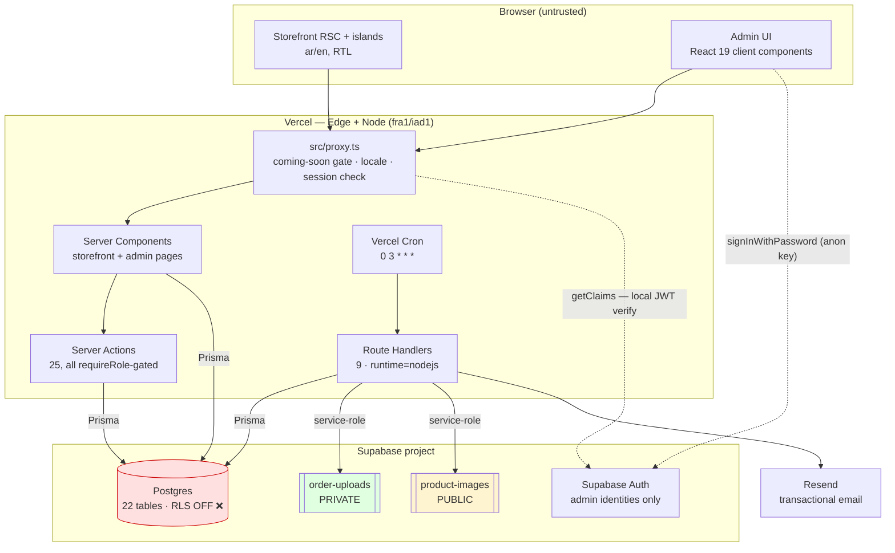
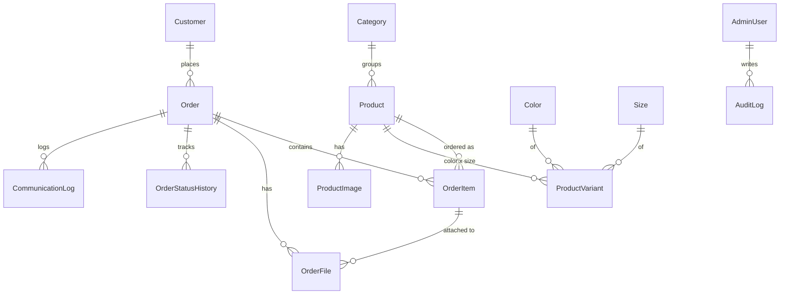
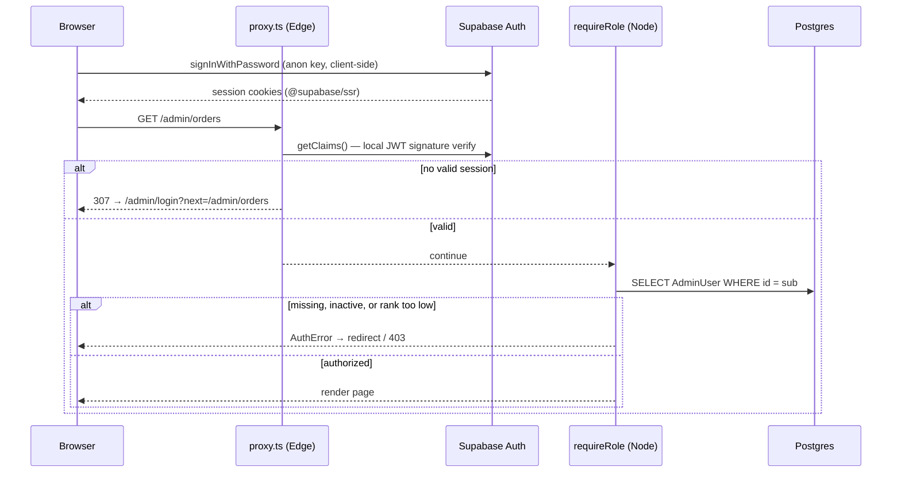
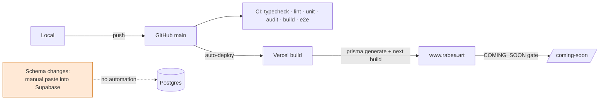
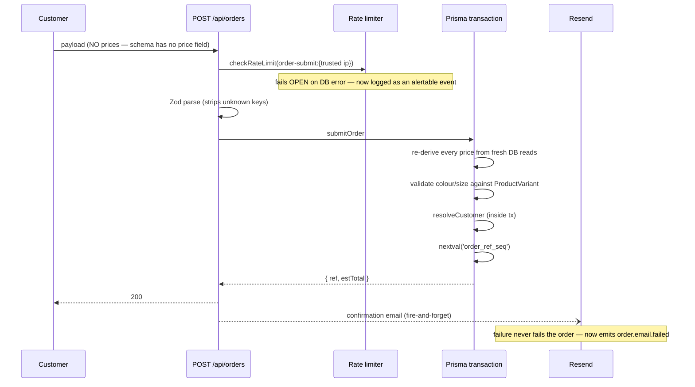
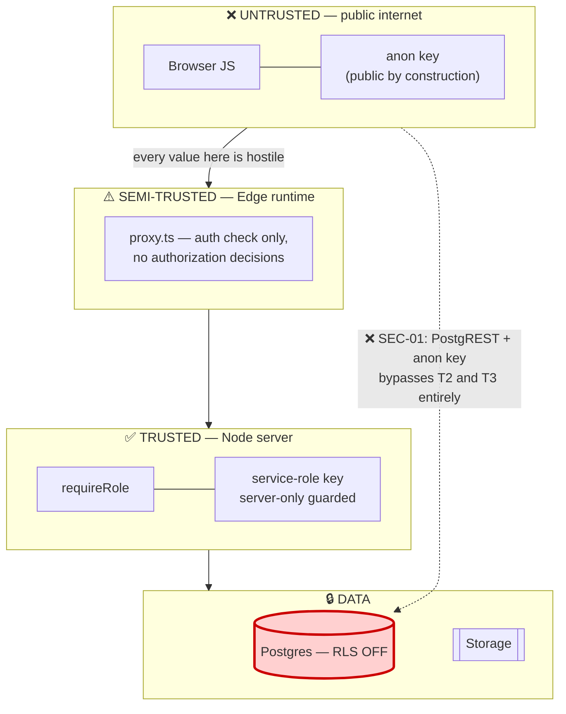

# Architecture — rabea.art

## Current architecture

A single Next.js 16.2.10 application deployed on Vercel, serving two distinct surfaces from one
codebase: an Arabic-first (RTL) public storefront under `/[locale]/**`, and a role-gated admin
back office under `/admin/**`. All persistence is Supabase (Postgres + Auth + Storage), reached
exclusively from the server.

The defining architectural property: **the browser never talks to the database or to storage.**
Its only direct Supabase interaction is `signInWithPassword` on the admin login form. Everything
else flows through Server Components, Server Actions, and Route Handlers using Prisma or the
service-role client. This is what makes the current (missing) RLS posture survivable so far —
and also what makes the anon key the whole risk, since it is the one credential that reaches
untrusted ground.

## Frontend architecture

- **Routing:** App Router. Storefront is locale-segmented (`/[locale]/(storefront)/…`); admin is
  deliberately *not* locale-prefixed and resolves its language from the shared `rabea_locale`
  cookie instead.
- **i18n:** `next-intl` with `localePrefix: "as-needed"` and `localeDetection: false`. Arabic is
  the default with no prefix; English lives at `/en`. Detection is off by intent — most of the
  studio's customers browse on non-Arabic devices, so `Accept-Language` works against the brand.
- **Rendering:** 54 files carry `"use client"`. The largest are genuinely stateful
  (`CustomWizard.tsx` 704 lines, `ProductView.tsx` 648, `OrderFlow.tsx` 453). `ProductCard` is the
  model to follow — an async Server Component that fetches its own translations and pushes only
  the tilt wrapper to the client.
- **Styling:** CSS Modules over a token layer (`src/styles/tokens.css`). No CSS framework.
- **Product imagery is procedural.** `ProductCard` and `Gallery` render CSS gradients derived from
  the product slug, not photographs — so the image pipeline described in `next.config.ts` is not
  yet exercised by anything.

## Backend architecture

Three server entry points, with a consistent authorization story:

| Surface | Count | Gate |
|---|---|---|
| Route Handlers | 9 | Admin routes call `requireRole()` as the first statement; 3 public routes are rate-limited |
| Server Actions | 25 | Every one calls `requireRole()`; only `logoutAction` and `setAdminLocaleAction` are ungated, by design |
| Server Components | all admin pages | `requireAdminPage()` → redirect to login on `AuthError` |

`requireRole` (`src/lib/auth/requireRole.ts:27-36`) is the single authorization primitive. It
re-reads the `AdminUser` row from Postgres on **every** request rather than trusting a JWT claim,
which means deactivating an admin takes effect immediately with no stale-token window. The role
ranking is `STAFF(0) < ADMIN(1) < OWNER(2)`, compared with `>=`.

Order submission (`src/lib/orders/submit.ts`) is the most security-sensitive path and is the
best-built one: no price field exists anywhere in the request schema, so client prices cannot be
injected even in principle; every price is re-derived from a fresh database read; option
combinations are re-validated against `ProductVariant` rows; and the whole thing runs in one
transaction with idempotency enforced by a unique constraint plus a `P2002` catch.

## Database architecture

22 tables, 7 enums, one migration (`prisma/migrations/0_init/migration.sql`, 471 lines).
Prisma 7 with the `@prisma/adapter-pg` driver adapter — no query engine binary.

Two objects exist **only** in the raw migration SQL and are invisible to `schema.prisma`:
`order_ref_seq` (load-bearing — `submit.ts:357` calls `nextval()` on it, and order submission
fails without it) and a `stock >= 0` CHECK constraint. Prisma models neither sequences nor CHECKs,
so a `prisma db push` would silently produce a database where orders cannot be created.

Schema changes are applied by pasting SQL into the Supabase editor (`docs/SETUP-DATABASE.md:12`).
There is no `prisma migrate deploy` in any pipeline and no `_prisma_migrations` bookkeeping in the
target database, so there is currently no defined path for migration #2.

## Storage architecture

| Bucket | Visibility | Contents | Key format |
|---|---|---|---|
| `order-uploads` | **Private** | Customer reference photos | `{draftId-uuid}/{object-uuid}.{ext}` |
| `product-images` | Public | Admin product photography | `{productId}/{uuid}.{ext}` |

The upload flow has a genuine trust boundary at `/api/uploads/verify`: it re-reads size and MIME
from Storage server-side rather than trusting the client's claims, and **deletes the object** if
either fails. Object keys are server-minted UUIDs, so the client filename never reaches the
storage path — path traversal is not reachable.

Orphan cleanup runs nightly and deletes `order-uploads` objects older than 24h with no matching
`OrderFile` row. **`product-images` has no equivalent** — an admin who uploads photos and
navigates away leaves permanently orphaned objects that nothing will ever collect.

## Authentication flow

Two-stage by design: the edge check is **authentication only** (coarse, cheap, JWT-verified), and
all **authorization** happens in the Node runtime against live database state. A logged-in STAFF
reaches `/admin/users` at the edge and is refused by `requireRole(OWNER)` at the page.

## Deployment flow

CI and deployment are **independent** — Vercel deploys on push regardless of whether CI passed,
unless branch protection is configured (unverified; see FINDINGS CI-01).

## External services

| Service | Purpose | Failure behaviour | Credential |
|---|---|---|---|
| Supabase Postgres | All persistence | Hard failure; pages catch and render empty states | `DATABASE_URL` (pooled), `DIRECT_URL` |
| Supabase Auth | Admin identity | Admin locked out; storefront unaffected | anon key (public) |
| Supabase Storage | Uploads, product images | Upload/preview failure; orders still submit | service-role key (server-only) |
| Resend | Order emails | **Silent** — order still succeeds, email lost | `RESEND_API_KEY` |
| Vercel Cron | Nightly orphan cleanup | Silent — storage grows | `CRON_SECRET` |

## Data flow — order submission

## Trust boundaries

**The dotted line is the entire finding.** Every trust boundary in this system is correctly
placed and correctly enforced — except that PostgREST offers a path from the untrusted zone
straight to the data zone, going around both of them. RLS (or disabling the Data API) is what
removes that edge.

## Production architecture recommendation

Near-term the current shape is right for the traffic. Recommended changes, in order:

1. **Close the PostgREST edge** — `docs/rls-lockdown.sql` + remove `public` from exposed schemas.
2. **Pin regions.** Set `vercel.json` `regions` to match the Supabase project's region; today the
   functions default to `iad1` regardless of where the database lives.
3. **Add an observability sink.** `src/lib/log.ts` emits structured events; point a Sentry DSN
   and one uptime check at them.
4. **Cache the catalog.** It is near-static data currently re-queried per request, and the
   `revalidatePath` invalidation plumbing is already written across ~30 admin mutation sites —
   there is simply nothing cached for it to invalidate.
5. **Introduce migration discipline** before schema change #2: baseline `_prisma_migrations`, and
   move `order_ref_seq` into a tracked migration so `db push` cannot silently break ordering.

Explicitly **not** recommended at this scale: queues, Redis, read replicas, multi-region. The
Postgres-backed rate limiter is the correct call for this traffic; revisit only if the storefront
sustains meaningful concurrency.
